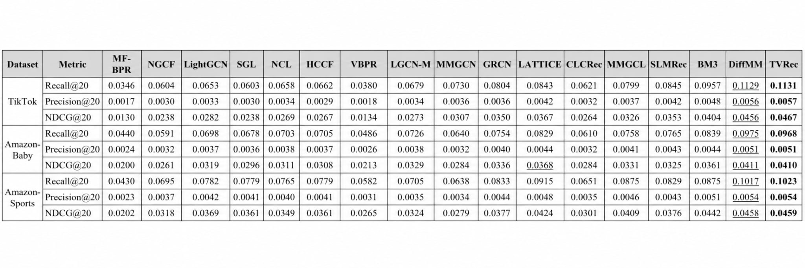
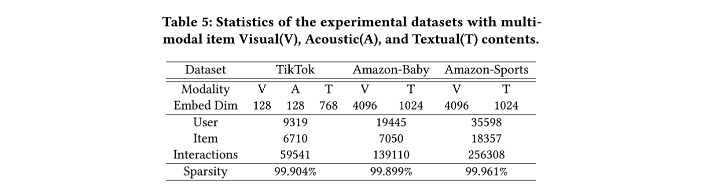

# TVRec: Flow-Guided Triangle Velocities Synergy for Multimodal Recommendation

This is the PyTorch implementation of **TVRec**, a multimodal recommendation framework built upon [**DiffMM**](https://github.com/HKUDS/DiffMM) (ACM MM 2024) and inspired by **Triangle Velocities Synergy (TVS)** from [**Optical Flow Matching (OFM)**](https://openaccess.thecvf.com/content/CVPR2026/html/Luo_Optical_Flow_Matching_Reframing_Optical_Flow_as_Continuous_Transport_Dynamics_CVPR_2026_paper.html) (CVPR 2026).

TVRec adapts the idea of TVS to user–item interaction reconstruction. Instead of directly predicting clean interaction vectors, the denoising module learns velocities along a main trajectory, an anchor-directed auxiliary trajectory, and a stationary auxiliary trajectory. The predicted velocity is converted into interaction scores to rebuild modality-specific user–item graphs. The framework retains DiffMM's multimodal graph aggregation and cross-modal contrastive learning. TVS is attributed to OFM; TVRec denotes the recommendation-specific adaptation implemented in this repository.

## Environment

The implementation uses the following dependencies:

- Python
- PyTorch with CUDA support
- NumPy
- SciPy
- tqdm
- setproctitle

## Experimental Results

Performance comparison on TikTok, Amazon-Baby, and Amazon-Sports in terms of **Recall@20**, **Precision@20**, and **NDCG@20**:



## How to Run the Codes

The example commands below train TVRec on the three supported datasets. Unspecified hyperparameters use the defaults in [Params.py](Params.py). These examples are not tuned configurations for reproducing paper results.

Prepare the datasets as described in the **Datasets** section, then run the commands from the repository root.

- **TikTok**

```bash
python Main.py --data tiktok --reg 1e-4 --ssl_reg 1e-2 --epoch 50 --trans 1 --e_loss 0.1 --cl_method 1 --anchor_w 2.0
```

- **Baby**

```bash
python Main.py --data baby --reg 1e-5 --ssl_reg 1e-1 --keepRate 1 --e_loss 0.01 --anchor_w 2.0
```

- **Sports**

```bash
python Main.py --data sports --reg 1e-6 --ssl_reg 1e-2 --temp 0.1 --ris_lambda 0.1 --e_loss 0.5 --keepRate 1 --trans 1 --anchor_w 2.0
```
## Structure

```text
.
├── README.md
├── Main.py
├── Model.py
├── Params.py
├── DataHandler.py
├── Utils
│   ├── TimeLogger.py
│   └── Utils.py
├── figures
│   ├── model.png
│   ├── dataset.png
│   └── performance.png
└── Datasets
    ├── README.md
    ├── baby
    │   ├── image_feat.npy.zip
    │   ├── text_feat.npy
    │   ├── trnMat.pkl
    │   ├── tstMat.pkl
    │   └── valMat.pkl
    └── tiktok
        ├── audio_feat.npy
        ├── image_feat.npy
        ├── text_feat.npy
        ├── trnMat.pkl
        ├── tstMat.pkl
        └── valMat.pkl
```

## Datasets



## Citation
